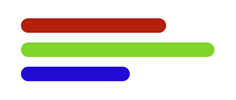

# 

**Grapper** is a free and open-source **web component for data visualization**, designed as a
**low-level microframework** to create **custom, dynamic, and interactive visualizations** with 
**SVG + directives**. It offers **flexibility in design**, enabling unique and aesthetic 
visualizations far beyond the typical monotonous charts.

## ✨ Features

- ⚡ **Microframework** — lightweight, no build step required  
- 📊 **Data-driven** — declarative binding between data and SVG  
- 🖼️ **Native** — built on top of `<svg>` with powerful directives (`g-for`, `g-bind`, `g-if`, `g-on`, …)  
- 🔄 **Reactive** — smooth and efficient updates when data changes  
- 🎨 **Configurable** — use JSON/JSON5 for palettes, margins, scales, etc.  
- 🛠️ **Extensible** — methods for interactivity, data transformation, and plugins  

## 📖 Documentation & Playground

- Full documentation: [grapper.io](https://grapper.io/)  
- Interactive Playground: [playground.grapper.io](https://playground.grapper.io/)  
- GitHub: [graphery/grapper](https://github.com/graphery/grapper)  
- NPM: [grapper](https://www.npmjs.com/package/grapper)

## 🚀 Installation

Use via **CDN**:

```html
<script src="https://cdn.jsdelivr.net/npm/grapper/dist/view.js"></script>
````

Or install via **npm**:

```bash
npm install grapper
```

## Quick Example

This example demonstrates a very basic bar chart using `grapper-view`:



```html
<grapper-view id="example-starter">
  <template>
    <svg viewBox="0 0 200 100" width="200px" height="100px">
      <g stroke-width="12" stroke-linecap="round">
        <line g-for="(record, index) of data"
              x1="22"
              :x2="record.value"
              :y1="index * 20 + 30"
              :y2="index * 20 + 30"
              :stroke="record.color"/>
      </g>
    </svg>
  </template>
  <script type="data">
    [
      { "color": "#D80000", "value": 130 },
      { "color": "#00D800", "value": 170 },
      { "color": "#0000D8", "value": 100 }
    ]
  </script>
</grapper-view>
```

Grapper is based on SVG and directives, providing a **declarative way** to build **data-driven
graphics**. This approach allows designers and developers to focus on **visual storytelling** with
**smooth rendering** and **high runtime performance** — all with a **tiny footprint** and **no
pre-compilation**.

## Authors & Acknowledgment

Grapper has been created by the [**Graphery**](https://www.graphery.com/) team.
Thanks to contributors and friends for their support and feedback. 🙏

## Contributing

We welcome contributions!
Feel free to **report issues**, **suggest features**, or submit **pull requests**.

## License

Grapper is licensed under the **MIT License**.
See the [LICENSE](LICENSE.md) file for details.

---

## From Graphane 1.0.x to Grapper 1.1.x

Grapper is the **next version of Graphane**.  
The project was renamed to avoid conflicts with other products and improve discoverability.

The main changes are:

- `<g-composer>` → `<grapper-view>`
- `$$.` helpers → unified under `$.` (the old namespace still works but is deprecated)

Existing Graphane projects will continue to run, but **new projects should use Grapper**.  
Migration is incremental — you can update components one by one without breaking anything.
